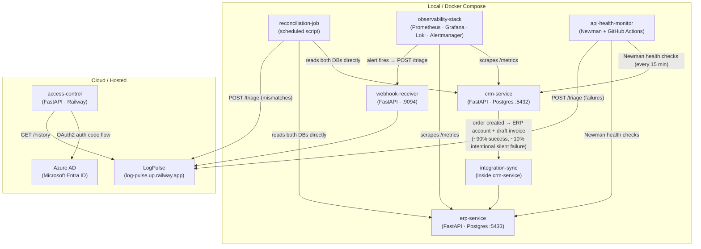

# PulseGrid


> A full-stack CRM/ERP portfolio application demonstrating enterprise integration patterns,
> observability, AI-assisted error triage, and Azure AD identity-based access control.

---

## Live Demo

| Service | URL |
|---|---|
| **Operations Dashboard** | Deployed on Railway — Azure AD login required |
| **LogPulse triage feed** | https://log-pulse.up.railway.app |

> The dashboard's mismatch and service-health sections require a local Docker Compose stack.
> The LogPulse triage history section is live in the hosted deployment.

---

## What PulseGrid Does

PulseGrid simulates a realistic business environment where a **CRM system** (customers, orders, tickets) and an **ERP system** (invoices, inventory, accounts) are kept in sync — **imperfectly, by design**.

A scheduled **reconciliation job** detects the ~10% intentional sync gap and routes discrepancies to **[LogPulse](https://log-pulse.up.railway.app)**, an AI-assisted triage service that classifies errors and suggests root causes. The system is fully observable via a **Prometheus / Grafana / Loki** stack, and access to the operations dashboard is gated behind **Azure AD (Microsoft Entra ID)** OAuth2 login.

> **⚠ The ~10% CRM↔ERP sync failure rate is intentional — it simulates real-world integration failures for resilience testing. It is not a bug.**

---

## Architecture



---

## Components

| Component | Role | Port |
|---|---|---|
| `crm-service` | FastAPI — customers, orders, tickets (PostgreSQL) | 8000 |
| `erp-service` | FastAPI — invoices, inventory, accounts (PostgreSQL) | 8001 |
| `integration-sync` | Inside crm-service: triggers ERP invoice on order creation, ~10% intentional silent failure | — |
| `reconciliation-job` | Scheduled script: reads both DBs, finds mismatches, deduplicates, reports to LogPulse | — |
| `api-health-monitor` | Postman/Newman on GitHub Actions cron (every 15 min): checks all endpoints, reports failures | — |
| `observability-stack` | Prometheus · Grafana · Loki · Alertmanager · Pushgateway · webhook-receiver | 3000 / 9090 / 3100 |
| `access-control` | Auth-gated dashboard: Azure AD OAuth2 login, mismatch counts, LogPulse history | 8002 |
| `pulsegrid_common` | Shared library: LogPulse HTTP client, SQLite dedup store | — |

---

## Tech Stack

| Layer | Choice |
|---|---|
| Language | Python 3.12 |
| Web framework | FastAPI + Uvicorn |
| Database | PostgreSQL (separate instance per service) |
| ORM | SQLAlchemy 2 + psycopg (v3) |
| Package manager | uv |
| Auth | Azure AD / MSAL — OAuth2 Authorization Code flow |
| Sessions | itsdangerous URLSafeSerializer — signed cookie, 8h TTL |
| Observability | Prometheus · Grafana · Loki · Alertmanager · Pushgateway |
| API testing | Postman + Newman CLI |
| CI | GitHub Actions (scheduled health checks) |
| Containerisation | Docker + Docker Compose |
| Hosting | Railway (access-control service) |
| Error triage | LogPulse — external AI-assisted RCA service (HTTP only) |

---

## Key Design Decisions

- **Intentional fault injection** — `SYNC_FAILURE_RATE=0.10` (tunable env var) silently drops ~10% of CRM→ERP syncs. Orders always return `201`; the failure is invisible to the caller. The reconciliation job exists specifically to detect and report this gap.
- **Deduplication everywhere** — LogPulse is never spammed. Every reporter (reconciliation-job, api-health-monitor, webhook-receiver) uses a SQLite dedup store with a 24-hour cooldown per error key.
- **Graceful degradation** — if LogPulse is unavailable, services log and continue. If CRM/ERP DBs are unreachable in the hosted deployment, the dashboard shows a clean notice rather than an error.
- **Shared library, not copy-paste** — `pulsegrid_common` is a path-dependency package imported by all three LogPulse callers to keep the HTTP client and dedup logic in one place.
- **No message broker** — services communicate via synchronous HTTP or direct DB reads. Appropriate for a demo/portfolio; documented in `docs/tech-debt-tracker.md` for production considerations.

---

## Local Setup

### Prerequisites

- Docker + Docker Compose
- [uv](https://github.com/astral-sh/uv) — `pip install uv`

### 1. Clone

```bash
git clone https://github.com/yashsolanki27/pulsegrid.git
cd pulsegrid
```

### 2. Configure environment

```bash
cp .env.example .env
# Edit .env — add Azure AD credentials for the login gate
# CRM/ERP services run without access-control for local API testing
```

### 3. Start CRM + ERP services

```bash
# Terminal 1
cd crm-service && docker compose up --build

# Terminal 2
cd erp-service && docker compose up --build
```

### 4. Seed data

```bash
cd crm-service && uv run python seed.py
cd erp-service && uv run python seed.py
```

### 5. Start observability stack

```bash
cd observability-stack && docker compose up --build
# Grafana    → http://localhost:3000  (admin / admin)
# Prometheus → http://localhost:9090
```

### 6. Run reconciliation job

```bash
cd reconciliation-job && uv run python run.py
```

### 7. Start access-control dashboard (requires Azure AD credentials in `.env`)

```bash
cd access-control && docker compose up --build
# Dashboard → http://localhost:8002
```

---

## API Overview

### CRM Service (`localhost:8000`)

| Method | Path | Description |
|---|---|---|
| `GET` | `/customers` | List all customers |
| `POST` | `/customers` | Create customer (duplicate email detection) |
| `GET` | `/orders` | List all orders |
| `POST` | `/orders` | Create order → triggers ERP sync |
| `GET` | `/tickets` | List all tickets |
| `GET` | `/health` | Liveness check |
| `GET` | `/metrics` | Prometheus metrics |

### ERP Service (`localhost:8001`)

| Method | Path | Description |
|---|---|---|
| `GET` | `/invoices` | List all invoices |
| `POST` | `/invoices` | Create invoice |
| `GET` | `/inventory` | List inventory items |
| `GET` | `/accounts` | List accounts |
| `GET` | `/health` | Liveness check |
| `GET` | `/metrics` | Prometheus metrics |

### Access Control (`localhost:8002` / Railway)

| Method | Path | Description |
|---|---|---|
| `GET` | `/` | Dashboard (auth-gated) |
| `GET` | `/auth/login` | Redirect to Azure AD |
| `GET` | `/auth/callback` | OAuth2 callback |
| `GET` | `/auth/logout` | Clear session |
| `GET` | `/health` | Liveness check (no auth) |

---

## Test Results

| Suite | Result |
|---|---|
| CRM service (Postman/Newman) | ✅ Passed |
| ERP service (Postman/Newman) | ✅ 44/44 assertions, 25 requests |
| Integration sync (40-iteration loop) | ✅ 136/136 assertions — 35 sync hits, 5 sync misses (~12.5%) |
| API health monitor (all 6 entity endpoints) | ✅ Passed |

---

## Project Structure

```
pulsegrid/
├── crm-service/            # FastAPI CRM (customers, orders, tickets)
├── erp-service/            # FastAPI ERP (invoices, inventory, accounts)
├── reconciliation-job/     # Scheduled mismatch detector → LogPulse
├── api-health-monitor/     # Postman/Newman suite + GitHub Actions workflow
├── observability-stack/    # Prometheus, Grafana, Loki, Alertmanager, webhook-receiver
├── access-control/         # Auth-gated dashboard (Azure AD + Railway)
├── pulsegrid_common/       # Shared LogPulse client + dedup store
├── postman/                # Postman collections
├── docs/                   # Architecture, stack, patterns, tech-debt, learnings
└── .github/workflows/      # GitHub Actions (api-health-monitor cron)
```

---

## Deployment (Railway)

The `access-control` service is deployed to Railway via the root `railway.json`.

Required Railway environment variables:

| Variable | Description |
|---|---|
| `AAD_CLIENT_ID` | Azure AD app registration client ID |
| `AAD_CLIENT_SECRET` | Azure AD client secret **value** (not the Secret ID/GUID) |
| `AAD_TENANT_ID` | Azure AD tenant ID |
| `AAD_REDIRECT_URI` | Must match the redirect URI registered in Azure Portal |
| `SESSION_SECRET_KEY` | `python -c "import secrets; print(secrets.token_hex(32))"` |

See `.env.example` for all variables and format notes.

---

*PulseGrid · Python · FastAPI · Azure AD · Prometheus/Grafana · PostgreSQL · Railway*
